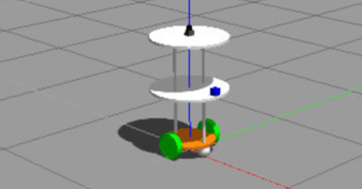
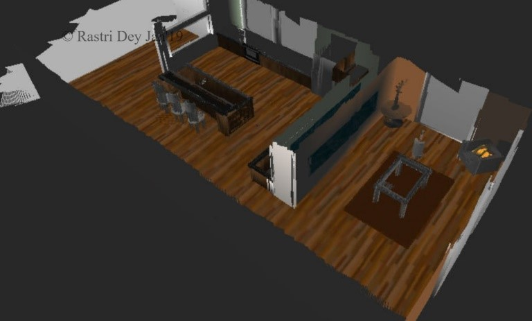
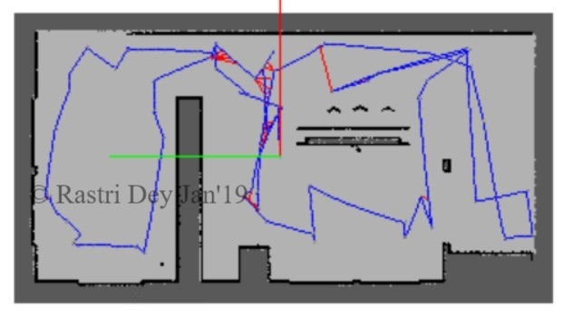
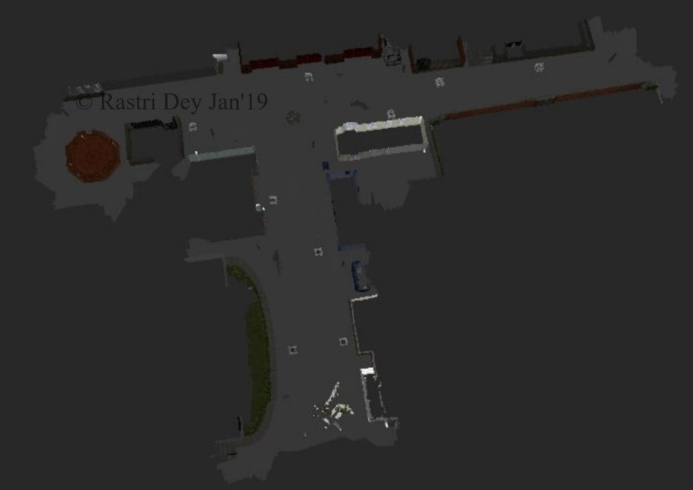
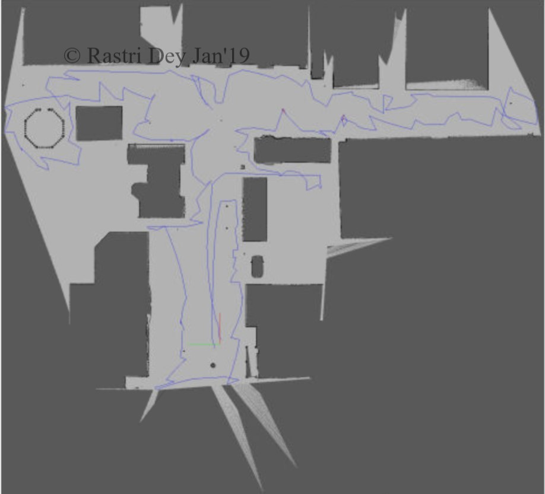

# RoboND Project: Map My World

The Map My World project is the SLAM (Simultaneous Localization and Mapping) project of the Udacity Robotics Software Engineer Nanodegree. A Real-Time Appearance Based Mapping (RTAB-Map) via ROS packages are applied to perform SLAM in a simulated environment. 

**Note:** See the writeup for theoretical content on SLAM algorithms and complete specifics of RTAB-Map with Results.

## Installation & Build

### ROS Kinetic
The project was developed on Ubuntu environment of Udacity Workspace with [ROS Kinetic](http://wiki.ros.org/kinetic), [Gazebo](http://gazebosim.org/) and [catkin](http://wiki.ros.org/catkin) installed.

### Dependencies
The robot relies on the ``rtabmap_ros`` ROS package, which should be installed in local system through ``apt-get``.

### Building the Workspace

Run and build the packages using:

```
$ cd catkin_ws
$ catkin_make
$ source devel/setup.bash
```

### Running the Scripts

The below commands are allowed to run in separate terminals:

Launch the world in Gazebo:

``$ roslaunch slam_project slam_world.launch``

Launch the teleop node for keyboard control:

``$ roslaunch slam_project teleop.launch``

Launch the RTAB-Map mapping node

``$ roslaunch slam_project mapping.launch``

Launch the RViz GUI:

``$ roslaunch slam_project rviz.launch``

** Note: ** The default world is the custom world ``Door_To_Door_Service.world``. To run ``kitchen_dining.world``, change in ``world.launch`` file for ``kitchen_dining.world`` in place of ``Door_To_Door_Service.world``

## Project Content

### Tasks
There are two tasks involved in this project: 
1. build up robot model configuration 
2. Integrate ``rtabmap`` for SLAM.

#### Robot Model Configuration
The robot model was extended from the previous project ``RoboND-Where-Am-I`` and has an RGB-D camera to input depth information to RTAB-Map.



#### ``rtabmap`` for SLAM
The robot uses the information from the odometer, the RGB-D camera and the laser rangefinder to perform SLAM in the designated environment through ``rtabmap``. The ``rtabmap`` library produces map database files that can be read by its own visualization tools. Here is an image of the reconstructed kitchen dining environment:



The 2D Map represesntation of ``Kitchen_dining.world``:



### RTAB Map Database Files

The 3D Map representation through RTAB-Map's database viewer for custom world:



The 2D Map represesntation of ``Door_To_Door_Service.world``:



The project is developed with an intent of Door to Door robot delivery service for food or medical supplies. In future, such work could be a possible reality !!